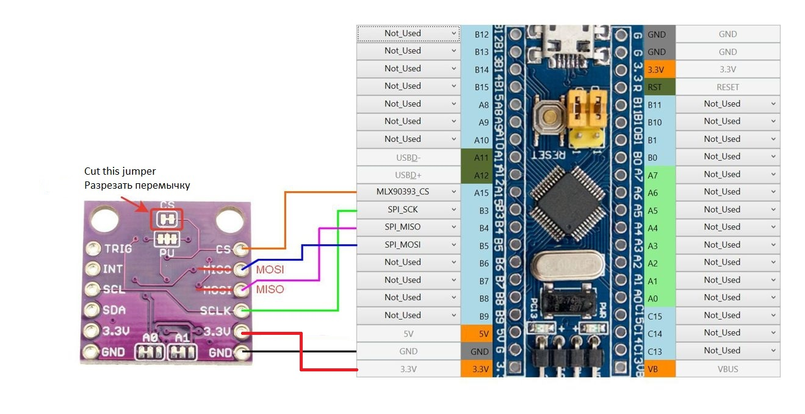

[开始页](../README.md) | [上一页](./轴的连接.md) | [English](../eng/MLX90393-connection.md)

MLX90393是一个使用SPI接口的三通道数字霍尔传感器。

 
* SPI_SCK - 时钟信号，对所有SPI设备都一样（TLE5011、MLX90393、MCP32XX和所有移位寄存器）；
* SPI_MISO - 主设备输入，从设备输出，对所有SPI设备都一样；
* SPI_MOSI - 主设备输出，从设备输入，对所有SPI设备都一样；
* MLX90393_CS - 片选信号，每个MLX90393单独连接。

像上图显示这个传感器已经焊在了板子上，可以买到像这样适用于最小开发的传感器板子。

MLX90393的磁体安装和霍尔传感器的相似，但是必须要考虑到这个传感器会给出三轴的磁场强度（X、Y - 平行于传感器平面，和Z - 垂直于传感器平面）。传感器和磁体可能的相对位置如下：

当需要读取最精确的数据的时候，可以将MLX90393用于监控控制器中最重要轴，也就是在模拟器中使用最频繁的轴。由于MLX90393可以读取磁体在两个相互垂直的轴上的运动，可以使用一个MLX90393制作一个摇杆。因为MLX90393像霍尔传感器一样是没有接触的，它的寿命几乎是无限的。

[轴的配置](轴的配置.md)部分会说明接下来在FreeJoy的配置程序中如何配置轴。

[开始页](../README.md) | [上一页](./轴的连接.md) | [English](../eng/MLX90393-connection.md)
