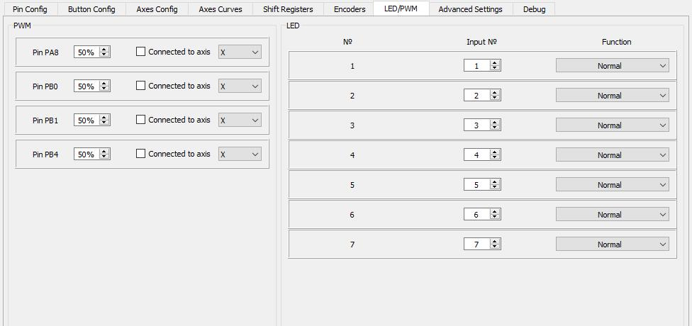

[开始页](../README.md) | [上一页](./LED的连接.md) | [English](../eng/RGB-LED-configuration.md)

## RGB LEDs 的连接

FreeJoy支持连接LEDs到四个可以调节亮度的通道。如果通过LED的电流不超过20 mA，那么可以像连接单个[单色LED](./单色LED配置.md)方式，将LED连接到A8、B0、B1、B4引脚（因为只有这些引脚支持发光的亮度调节），然后像图中所示为这些引脚分配LED_PWM功能。

如果你打算使用高功率的LEDs，那你需要使用三极管（2N2222或者类似的）来连接LED。上图显示了一个有公共正极的RGB LED的连接图。当在LED的引脚加上不同的电压时，你可以得到LED灯的不同颜色。

建议为每个LED单独计算限流电阻的阻值。你可以使用在线计算器进行计算。允许并联多个LEDs（必须要为每个LED都设置限流电阻）。同时，需要考虑到当所有的LEDs点亮的时候，通过所有LED的电流总和应当不超过350 mA。如果你将LEDs的公共正极连接到了5V引脚，你可以将通过LEDs的总电流提高到500 mA。但是当LEDs工作在大电流时，最好使用外部的电源（在这个例子中LEDs的正极断开了控制器的连接，并连接到了“+”外部电源，“-”外部电流连接到了控制器的“GND”引脚）。

图中，在左侧的“PWM”区域可以为LEDs分配可以调节亮度。你可以为每个通道指定百分比亮度。

[开始页](../README.md) | [上一页](./LED的连接.md) | [English](../eng/RGB-LED-configuration.md)
