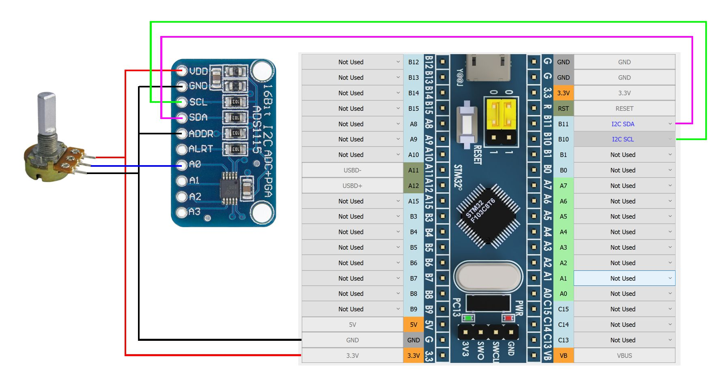

[开始页](../README.md) | [上一页](轴的连接.md) | [English](../eng/Connecting-analog-axes-to-ADS1115.md)

ADS1115是一个I2C接口的四通道模拟数字转化芯片（ADC）。

* I2C_SCL - 时钟信号，对所有I2C设备都一样（AS5600和ADS1115模拟数字转换模块）
* I2C_SDA - 数据信号，对所有的I2C设备都一样（AS5600和ADS1115模拟数字转换模块）

像上图展示的可以买到已经焊在板子上的ADC芯片。最多可以将4个ADS1115模块连接到控制板上（记住所有轴的数量不能超过8个）。要连接多个ADC模块到控制板上需要为这些设备设置不同的通讯地址。将设备的ADDR地址引脚接到控制板上的不同引脚，可以为设备设定不同的地址。总共有4个地址可供选择：

| 连接ADDR的引脚          | ADS1115的地址   |
| ----------------------- | --------------- |
| GND                     | 1001000         |
| VDD                     | 1001001         |
| SDA                     | 1001010         |
| SCL                     | 1001011         |

为ADC模块设置的地址一定要记住，在之后配置轴的时候需要用到。

[电位器](电位器的连接.md)、[霍尔传感器](霍尔传感器的连接.md)或者是任意类型的模拟传感器，只要它们的输出电压范围是0-3.3V，就可以作为外部ADC的信号源。

当需要减少传感器的连线数量时（比如在摇杆中），或者是需要减少长导线的电磁干扰时（在这种情况下需要把ADC连接在离模拟信号源近的地方），可以使用ADC连接模拟传感器。ADS1115使用的是慢速I2C接口，这使得在添加新的传感器到设置中后，会增加所有信号的处理时间，所以需要谨慎的使用ADS1115。

[轴的配置](轴的配置.md)部分会说明接下来在FreeJoy的配置程序中如何配置轴。

[开始页](../README.md) | [上一页](轴的连接.md) | [English](../eng/Connecting-analog-axes-to-ADS1115.md)
