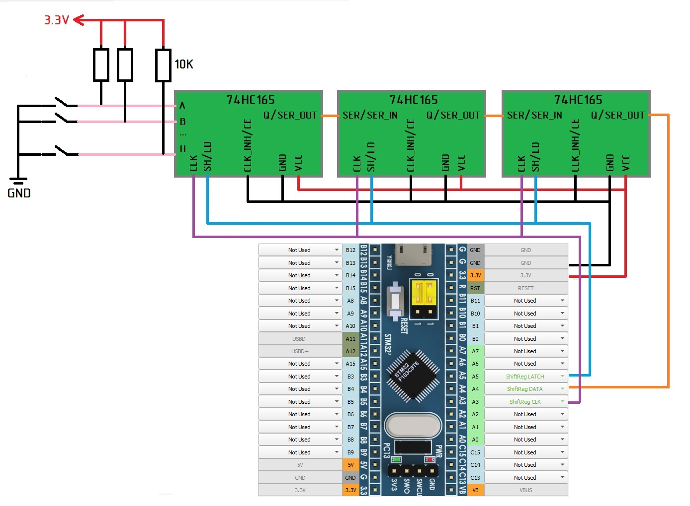
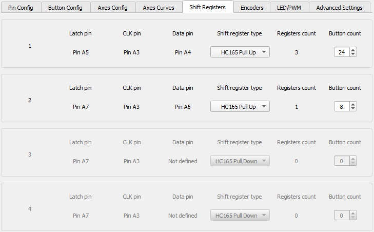

[开始页](../README.md) | [上一页](./按键的连接.md) | [English](../eng/Connecting-buttons-to-shift-registers.md)

# 使用74HC165移位寄存器演示将按键连接到移位寄存器

## 引脚分配

移位寄存器的连接示例如下：

移位寄存器的PCB板子可以买现成的，也可以自己制作。一个买到的移位寄存器PCB板：

用于DIY的移位寄存器图纸文件可以在这里找到：
https://github.com/FreeJoy-Team/FreeJoyWiki/blob/master/3rd-party/hardware/MMJoy2_74HC165.lay6

* ShiftReg_CLK - 所有的移位寄存器链可以单独连接也可以共同连接。
* ShiftReg_DATA - 每条移位寄存器链单独连接（这里，第二链移位寄存器连接到了A7、A6引脚）。
* ShiftReg_LATCH - 所有的移位寄存器链可以单独连接也可以共同连接。

建议将移位寄存器的VCC连接到+3.3V。

不同的电路板和移位寄存器有不同的引脚名称。见下面的表格：

| 配置程序中的名称    | 74HC165的引脚    | CD4021的引脚    | 可能的引脚名称          |
|---------------------|------------------|-----------------|-------------------------|
|    ShiftReg_CLK     |       CLK        |      CLOCK      |     SCK                 |
|    ShiftReg_DATA    |        Qh        |        Q8       |     DATA/SERIAL_OUT/OUT |
|    ShiftReg_LATCH   |       SH/LD      | PAR/SER CONTROL |     LATCH               |
|         3.3V        |        VCC       |       VDD       |     5V/V+               |
|         GND         |        GND       |       VSS       |     V-                  |
|    -------------    |        SER       |  SERIAL IN      |     INPUT/DATA_IN/IN    |
|    -------------    |     CLK_INH      |    ------------ |     CE                  |

## 指定移位寄存器的数目

上图中有3个移位寄存器连接到了A4、A5引脚，一个移位寄存器连接到了A6、A7引脚。

* 在“Button Count”选项中设置连接的物理按键的数量（移位寄存器的数量 * 8）。
* PullUp和PullDown - 连接到移位寄存器的按键类型。如果你连接好了移位寄存器后，当所有按键都没有被按下，但在“按钮配置”界面显示所有的按键都处于按下的状态时，你需要将“移位寄存器类型”从PullUp改成PullDown（或者是反过来）。

程序可以支持74HC165和CD4021型号的移位寄存器。这两款芯片都有DIP-16（直插）和SO-16（贴片）封装。上面例子中的74HC165的SO-16封装的Sprint Layout PCB板图纸可以在[这里](../3rd-party/hardware)找到。同样的（如果你自己不能制作板子的话），你可以使用这样的转接板：

所有类型的开关（按键、拨动开关、编码器等）都可以连接到移位寄存器。它们的设置和[把按键直接连接到控制器](./将按键直接连接到控制器.md)类似。

[开始页](../README.md) | [上一页](./按键的连接.md) | [English](../eng/Connecting-buttons-to-shift-registers.md)
