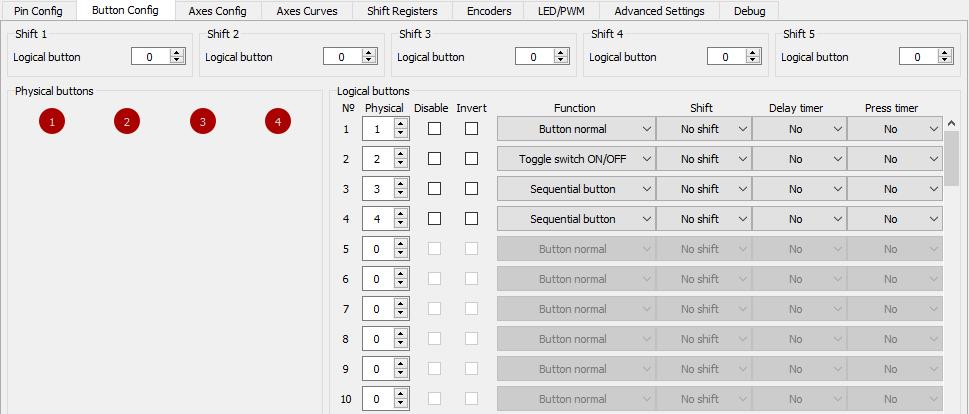

[开始页](../README.md) | [上一页](./按键的连接.md) | [English](../eng/Buttons-configuration.md)

基本定义：

* 物理按钮 - 通过某种方式连接到控制器的一对物理存在的接头（单独的按键、一个连接到按键矩阵的按键、一个连接到移位寄存器的按键，或者是通过这些方法连接的一个拨动开关）。可以在“按钮配置”的“物理按钮”界面看到已经连接的物理按钮和它们的状态（红色 - 松开，绿色 - 按下）。
* 逻辑按钮 - 发送给电脑的按下按键的信息。可以在“按钮配置”的“逻辑按钮”界面看到逻辑按钮的列表、逻辑按钮映射的物理按钮、按钮功能、shift功能。

### 3. 逻辑按钮的分配（“按钮配置”界面）

1. 在“按钮配置”的“逻辑按钮”界面，每一行代表一个逻辑按钮，你必须为逻辑按钮指定一个物理按钮才能使用。（你可以通过按下物理按钮找到它对应的编号。在“物理按钮”界面，表示被按下的物理按钮的带圈数字会用绿色高亮出来）

- 在把物理按钮分配给逻辑按钮，并将配置写入了控制器之后，你可以检查逻辑按钮的操作。当你按下物理按钮时，对应的逻辑按钮那一行也会按照按钮的逻辑功能被绿色高亮出来。一个物理按钮可以绑定到任意数量的逻辑按钮。

- 可以在“Debounce timer”选项中为所有的按键（同时地）设置去抖动时间。在这种情况下，当按下按键的时间小于设置的去抖动时间时，按键的按下动作会被忽略。如果你使用的是低质量按键，增大这个参数可以让你避免在只按下一次会有多次被按下的情况。

2. 按键功能：

* Button_normal - 正常的按键；
* Button_Toggle - 拨动开关，按下物理按键会把逻辑按钮的状态反转（如果逻辑按钮是松开的状态，按下物理按键将会使得逻辑按钮按下，直到物理按键再次按下）。

拨动开关的功能：

* ToggleSwitch_OnOff - 物理按键按下和松开时都会使得逻辑按钮按下（逻辑按钮按下的时间由“Press Timer”选项确定）；
* ToggleSwitch_On - 物理按键按下时会使得逻辑按钮按下（逻辑按钮按下的时间由“Press Timer”选项确定）；
* ToggleSwitch_Off - 物理按键松开时会使得逻辑按钮按下（逻辑按钮按下的时间由“Press Timer”选项确定）；

顶帽开关（HAT switches）功能（多位置按键/hats）

* PovX_Down, PovX_Up, PovX_Left, PovX_Right, PovX_Center（X是hat的数量） - 按下down/up/left/right方向对应的hat。PovX_Center只用于为Alps RKJX hats提供必须的操作逻辑。

单选按键功能：

* RadioButtonX（X表示单选按键所属组的编号） - 所有属于同一个组的单选开关会按照下面的方式工作：当你按下这个组中任意的物理按键，这个组中的所有逻辑按钮会松开，只有这个物理按键对应的逻辑按钮会保持按下。逻辑按钮会一直保持在按下状态，直到同一组的其它物理按键有被按下。当控制器开机时，这个列表中的第一个单选按键会被按下。单选按键可以用于shift功能。
* Sequential_Button - 序列开关模式 - 将一个物理按键分配给多个逻辑按钮，实现枚举功能。当物理按键按下时，当前处于按下状态的逻辑按钮会被松开，列表中的下一个逻辑按钮会被按下。
* Sequential_Toggle - 序列开关切换模式 - 将一个物理按键分配给多个逻辑按钮，实现枚举功能。当物理按键按下时，当前处于按下状态的逻辑按钮会被松开，列表中的下一个逻辑按钮会被锁住。

编码器功能：

* Encoder_A, Encoder_B - 见[编码器的连接](./编码器的连接.md)

### 额外设置

按键还有一些额外的设置：

* 反向 - 逻辑状态反转；
* 禁用 - 禁用该按键的系统输出；
* Shift - 设置激活修饰（activation modificator）(shift)；
* Delay timer - 在物理按键按下后，逻辑按钮延迟一定时间再按下；
* Press timer - 逻辑按钮会被锁住（保持按下状态）的时间。

### 4. 使用shift修饰功能

任意逻辑按钮可以作为shfit修饰（在“Shift X”选项中设置）。分配了shift修饰的逻辑按钮只会在满足下面两个条件的情况下工作：作为shift修饰的逻辑按钮是按下的，分配了shift修饰的逻辑按键是按下的。如果一个物理按键分配给了有shift修饰的逻辑按钮和没有shift修饰的逻辑按钮，那么没有shift修饰的逻辑按钮只会在shift修饰没有按下时工作。

### 5. 检查按键的操作

最后，可以检查按键的操作：

（Windows 10）“开始”，“设置”，“设备”，相关设置中“设备和打印机”，右键相应的设备，“游戏控制器设置”，选择相应的设备，“属性”。

对于超过32个按键的设备，你可以使用VKB_Btn Tester程序，程序可以在[这里](../3rd-party/software)找到。

[开始页](../README.md) | [上一页](./按键的连接.md) | [English](../eng/Buttons-configuration.md)
