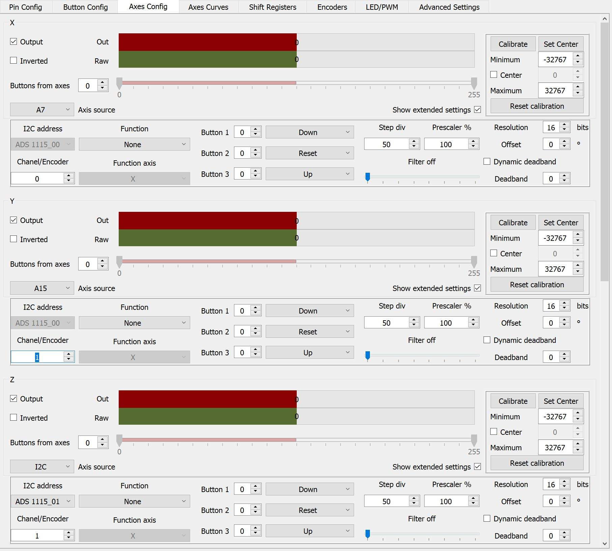

[开始页](../README.md) | [上一页](./轴的连接.md) | [English](../eng/Axis-configuration.md)

## 逻辑轴的分配：

像物理和逻辑按键一样，我们必须将物理轴分配给逻辑轴。

在配置程序的轴配置（Axes Config）界面，可以在每个模拟输出轴设置区域的左上角看到轴的名字。总共可以有8个轴：X、Y、Z、Rx、Ry、Rz、Silder1和Slider2。

你可以通过设置“轴数据源”（Axis source）将任意物理轴分配给任意的逻辑轴。其中：
* 对于模拟物理轴（[电位器](./电位器的连接.md)或[霍尔传感器](./霍尔传感器的连接.md)），物理轴的名称是控制板上的信号输入引脚（电位器是中间的引脚，霍尔传感器是信号输出引脚。在这个例子中将一个模拟传感器分配给了X轴，信号引脚连接在控制板的A7引脚）。
* 对于SPI数字传感器（[TLE5010/5011](./TLE501x的连接.md)、[MLX90393](./MLX90393的连接.md)、外部ADCs[MCP32XX](./使用MCP32XX连接模拟传感器.md)），物理轴的名称是片选信号引脚（在这个例子中，MLX90393传感器的片选引脚连接在控制板上的A15引脚，这个物理轴分配到了Y轴）。
* 对于I2C数字传感器（[AS5600](./AS5600的连接.md)、外部ADCs [ADS1115](./使用ADS1115连接模拟传感器.md)），物理轴的名称是由I2C接口的名称确定的，选项中的“I2C地址”显示了传感器的类型和地址（[ADS1115](./使用ADS1115连接模拟传感器.md)），地址由连接的ADDR引脚确定（在这个例子中，外部ADC [ADS1115](./使用ADS1115连接模拟传感器.md)使用01地址，并分配给了Z轴）。

除此之外对于多通道传感器（[MLX90393](./MLX90393的连接.md)）和ADC（[ADC ADS1115](./使用ADS1115连接模拟传感器.md)和[MCP32XX](./使用MCP32XX连接模拟传感器.md)），在“通道/编码器”选项中可以选择接收数据的通道（通道是从0开始计数）。（在这个例子中，Y轴读取的是传感器（[MLX90393](./MLX90393的连接.md)）的第二个通道的数据，Z轴读取的是外部ADC（地址是01的[ADS1115](./使用ADS1115连接模拟传感器.md)）的第一个通道的数据。
对于输入源是编码器时，你应当在“Encoders”选项中选定编码器的编号。

对于在项目中没有使用的轴，取消选中“Output”选项，以取消输出信号。

红色的数值范围显示的是逻辑轴发送给操作系统的值，绿色的数值范围显示的是控制器接收到的传感器物理轴的值。

## 轴的校准

分配好轴之后，必须将轴校准好（让物理轴的全部行程能和逻辑轴的全部行程对应）。

### 校准没有中心的轴

1. 点击“校准”，开始校准。
1. 将物理轴从一端的极限位置移动到另一端极限位置。
1. 点击“中止并保存”，结束校准。
1. 取消勾选“中心”复选框。
1. 点击左侧的“将配置写入设备”，将校准结果写入控制器。

### 校准有中心的轴

1. 点击“校准”，开始校准。
1. 将物理轴从一端的极限位置移动到另一端极限位置，然后停在中心位置。
1. 点击“中止并保存”，结束校准。
1. 点击左侧的“将配置写入设备”，将校准结果写入控制器。

### 使用数值范围偏移校准TLE5011数字传感器

如果你安装了一个数字传感器，并且当你将它从一个极限位置移动到另一个极限位置时，轴的物理值穿过了零点（比如物理值先增大到最大值，然后复位到零点，从零点开始继续增大），这时必须对传感器的读数范围进行偏移：

1. 勾选“展开更多选项”。
1. 将“偏移”设置成180。
1. 点击左侧的“将配置写入设备”，将校准结果写入控制器。
1. 检查移动物理轴时物理轴的值是否通过零点。
1. 如果物理轴的值依然通过零点：修正“偏移”的数值，重复步骤2-5。
1. 像校准没有中心的轴一样继续校准。

## 轴的额外设置

下面的设置可以在每个逻辑轴的设置中找到：

* 反向 - 将逻辑轴的输出反向（轴会被调整到相反的方向）；
* 分辨率 - 轴的位分辨率。分辨率确定轴一个行程中的采样数。对于模拟轴通常低于12的分辨率是合理的。对于数字传感器，你可以将分辨率提高到16（65536个采样数）；
* 动态死区 - 设置轴的动态死区。动态死区范围的大小在下面的“死区”选项中设置。在设置有动态死区的情况下，轴输出的没有超过死区的值将会被忽略。为了消除轴输出的抖动，可以逐渐增加死区范围的大小（每次修改过配置后，不要忘记把配置写入到控制器），直到当物理轴没有移动时逻辑轴不再自发的变化。当“动态死区”选项框没有勾选的时，设置的死区大小会被应用在中心死区。
* 滤波 - 可以选择轴滤波的滑块。可以设置为：off、1级 ... 7级。设置的滤波等级越高，逻辑轴值的变化将相对物理轴延迟更多，所以对于重要的轴，建议不要设置超过3级的滤波；
* Prescaler - 你将这个值设置成1%到255%，来改变轴的输出比例；
* 在“轴曲线”的界面，除了逻辑轴相对物理轴线性的输出，你可以设置一个需要的输出曲线。你可以使用预定义的曲线（线性（默认）、指数、反指数、任意曲线），或者你可以通过上下移动这些曲线上的点来修改曲线。

## 组合轴功能

在“Function”选项中，你可以选择加减两个轴的功能。

在这个功能中，第一个数据源是是物理轴（由“轴数据源”选项确定（在下文中用AS1表示）），第二个数据源是逻辑轴（由“Function axis”选项确定（在下文中用AS2表示））。

可以选择下面这些函数：

* Plus_Absolute = (AS1 + AS2) / 2
* Plus_Relative = (AS1 + AS2) +32767
* Minus_Absolute = (AS1-AS2) / 2
* Minus_ Relative = (AS1-AS2) -32767
* Equal AS1 = AS2

## 按键控制轴的功能

可以为每个轴设置最多3个按键，每个按键可以设置成这些功能：

* Down - 将轴的值递减32768/Step_Divider
* Up - 将轴的值递增32768/Step_Divider
* Reset - 复位轴的值
* 中心 - 将当前原始轴的值设置为逻辑轴输出的零值
* Function_Enable - 启用该轴的组合轴功能
* Prescaler_Enable - 启用该轴的prescaler比列

也可以把轴配置成[将轴的移动转换成按键](./使用轴模拟按键.md)

[开始页](../README.md) | [上一页](./轴的连接.md) | [English](../eng/Axis-configuration.md)
