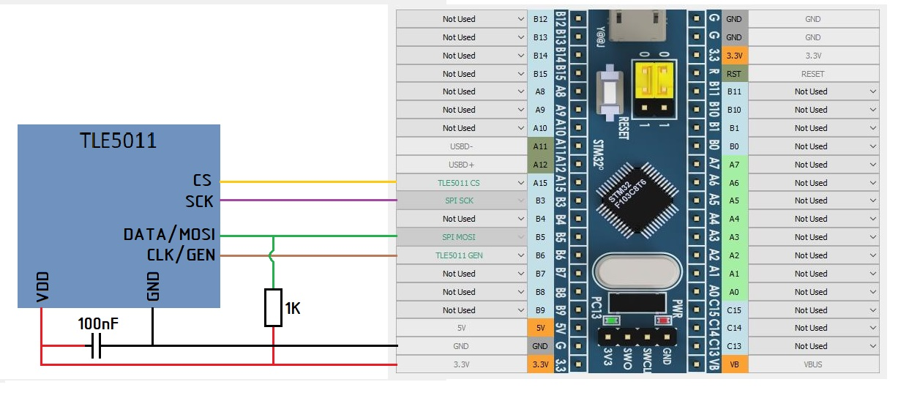
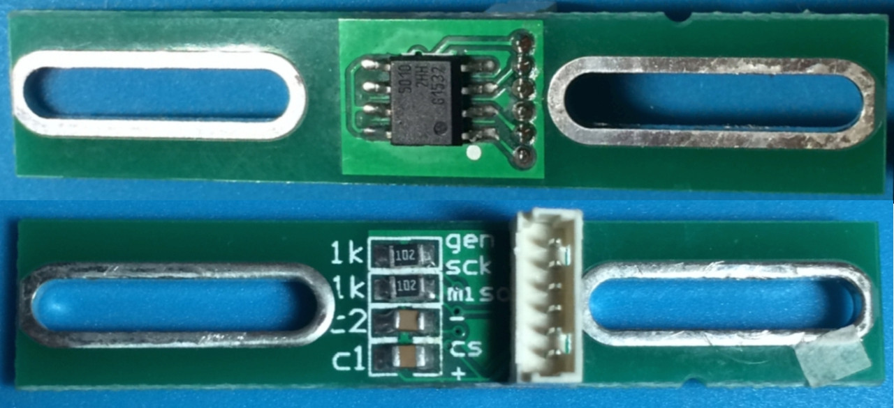

[На стартовую страницу](../README.md) | [Предыдущий раздел](Подключение-осей.md)

TLE5011, TLE5010, TLE 5012B - одноканальные цифровые датчики Холла. Работают по интерфейсу SPI.

Печатную плату для датчика можно изготовить самостоятельно, либо купить готовую. Файл для изготовления платы в Sprint Layout, находится здесь https://github.com/FreeJoy-Team/FreeJoyWiki/blob/master/3rd-party/hardware/TLE5011.lay6 Подлюкчение TLE 5012B отличается тем, что выводы 5 и 8 микросхемы никуда подключать не надо (в приведенной схеме они соединены с GND, что необходимо для работы TLE 5010, 5011).

**Внимание: Для линии данных датчиков TLE501х должен быть предусмотрен один резистор подтяжки к 3.3В номиналом не более 1кОм**

* SPI_SCK – Общий для всех SPI устройств (TLE5011,  MLX90393, MCP32XX и всех цепочек сдвиговых регистров);

* SPI_MOSI – общий для всех SPI устройств. На некоторых платах TLE могут встречаться обозначения MISO для этого пина;

* TLE5011_GEN – общий для всех TLE5011;

* TLE5011_CS – индивидуальный для каждого TLE5011.

  Расположение контактов контроллера которым можно назначить те или иные функции для подключения датчиков TLE5010, 5011, 5012B можно уточнить в [таблице мапинга](rus/Таблица-мапинга.md) в колонке SPI Devices.

Стоимость датчиков TLE5010 и TLE5011 сравнима с Датчиками Холла. Их рекомендуется применять для контроля наиболее важных осей контроллера, которые используются в симуляторах часто, и когда необходима наиболее высокая точность показаний. Ресурс датчиков TLE практически неограничен, т.к. они являются бесконтактными как и датчики Холла.

Готовую плату с датчиком TLE5010 можно приобрести на AliExpress, Ebay или Amazon:

Уже распаянные платы с TLE5011 являются редкостью,поэтому мы рекомендуем либо изготовить плату самостоятельно, например, при помощи ЛУТ (лазерно-утюжной технологии). Чертеж платы TLE 5011 для Sprint Layout можно взять [здесь](../3rd-party/hardware/)

Либо можно воспользоваться переходной платой, например такой:

Конденсатор можно впаять между соответствующими ножками разъема, а резистор подтяжки на стороне платы противоположной установке микросхемы между контактами соответствующими CS и +питания микросхемы.

Датчики TLE5011/5010 реагируют на смену направления оси магнитного поля относительно оси датчика. Для этого можно применять прямоугольные (как на рисунке), кубические магниты. Магниты в виде диска и кольцеобразные магниты можно применять убедившись, что они имеют **диаметральную** намагниченность.

Последующая настройка оси описана в разделе [Настройка осей](Настройка-осей.md)

[На стартовую страницу](../README.md) | [Предыдущий раздел](Подключение-осей.md)

